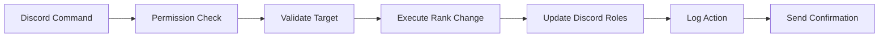

## What Makes Synera Different

Synera bridges the gap between Discord communities and Roblox group management through intelligent automation and seamless integration. Unlike traditional bots that require complex setup and maintenance, Synera is designed to work out of the box while providing advanced customization options for power users.

## Core Architecture

  

    

      <svg className="w-8 h-8 text-blue-600 dark:text-blue-400" fill="currentColor" viewBox="0 0 20 20">
        <path d="M9 12l2 2 4-4m6 2a9 9 0 11-18 0 9 9 0 0118 0z"/>
      </svg>
    

    <h3 className="text-lg font-semibold mb-2">Discord Layer</h3>
    
Handles user interactions, slash commands, and role management within your Discord server.

  

  
  

    

      <svg className="w-8 h-8 text-purple-600 dark:text-purple-400" fill="currentColor" viewBox="0 0 20 20">
        <path d="M4 4a2 2 0 00-2 2v8a2 2 0 002 2h12a2 2 0 002-2V6a2 2 0 00-2-2H4zm2 6a2 2 0 114 0 2 2 0 01-4 0zm8-1a1 1 0 100 2 1 1 0 000-2z"/>
      </svg>
    

    <h3 className="text-lg font-semibold mb-2">Synera Core</h3>
    
The intelligent middleware that processes commands, manages permissions, and orchestrates actions.

  

  
  

    

      <svg className="w-8 h-8 text-green-600 dark:text-green-400" fill="currentColor" viewBox="0 0 20 20">
        <path d="M9 6a3 3 0 11-6 0 3 3 0 016 0zM17 6a3 3 0 11-6 0 3 3 0 016 0zM12.93 17c.046-.327.07-.66.07-1a6.97 6.97 0 00-1.5-4.33A5 5 0 0119 16v1h-6.07zM6 11a5 5 0 015 5v1H1v-1a5 5 0 015-5z"/>
      </svg>
    

    <h3 className="text-lg font-semibold mb-2">Roblox Layer</h3>
    
Interfaces with Roblox groups to execute ranking changes and retrieve member information.

  

## Key Concepts

### 1. Community Setup

The foundation of Synera is the community setup process, which establishes the connection between your Discord server and Roblox group.

<Accordion title="Community Configuration">
  - **Group Binding**: Links your Discord server to one or more Roblox groups
  - **Authentication**: Securely stores credentials for group management
  - **Role Mapping**: Defines relationships between Discord roles and Roblox ranks
  - **Permission Structure**: Establishes who can perform various actions
</Accordion>

### 2. Ranking System

Synera's ranking system is built around the concept of **rank operations** - discrete actions that modify a member's position within a Roblox group.

### 3. Permission Hierarchy

Synera implements a sophisticated permission system that respects both Discord and Roblox hierarchies:

<CardGroup cols={2}>
  <Card title="Discord Permissions" icon="discord">
    Based on Discord roles and server permissions. Users must have appropriate Discord roles to execute ranking commands.
  </Card>
  <Card title="Roblox Permissions" icon="users">
    Respects Roblox group hierarchy. Users cannot rank members to positions higher than their own rank.
  </Card>
</CardGroup>

### 4. Synchronization

Real-time synchronization ensures consistency between Discord roles and Roblox ranks:

<Steps>
  <Step title="Event Detection">
    Synera monitors for changes in both Discord roles and Roblox group membership
  </Step>
  <Step title="Conflict Resolution">
    When discrepancies are detected, Synera applies configurable resolution rules
  </Step>
  <Step title="Batch Updates">
    Multiple changes are batched together for efficiency and rate limit compliance
  </Step>
  <Step title="Audit Trail">
    All synchronization actions are logged for transparency and debugging
  </Step>
</Steps>

## Data Flow

Understanding how data flows through Synera helps in troubleshooting and optimization:

<Tabs>
  <Tab title="Command Execution">
    1. **User Input**: Member executes a slash command in Discord
    2. **Authentication**: Synera verifies the user's permissions
    3. **Validation**: Target member and rank parameters are validated
    4. **Roblox API**: Ranking change is executed via Roblox API
    5. **Discord Update**: Corresponding Discord roles are updated
    6. **Logging**: Action is recorded in audit logs
    7. **Feedback**: Confirmation message is sent to the user
  </Tab>
  
  <Tab title="Automatic Sync">
    1. **Event Trigger**: Discord role change or Roblox rank change detected
    2. **Change Analysis**: Synera determines what needs to be synchronized
    3. **Conflict Check**: Identifies any conflicts or inconsistencies
    4. **Resolution**: Applies configured resolution strategy
    5. **Update Execution**: Makes necessary changes to maintain sync
    6. **Notification**: Optionally notifies relevant parties of changes
  </Tab>
  
  <Tab title="Bulk Operations">
    1. **Batch Preparation**: Multiple operations are queued together
    2. **Rate Limit Management**: Operations are spaced to respect API limits
    3. **Progress Tracking**: Real-time progress updates are provided
    4. **Error Handling**: Failed operations are retried or reported
    5. **Completion Report**: Summary of successful and failed operations
  </Tab>
</Tabs>

## Error Handling & Recovery

Synera implements robust error handling to ensure reliability:

<AccordionGroup>
  <Accordion title="API Rate Limits" icon="clock">
    - Automatic retry with exponential backoff
    - Queue management to prevent overwhelming APIs
    - Graceful degradation when limits are reached
  </Accordion>
  
  <Accordion title="Network Issues" icon="wifi">
    - Connection pooling and keep-alive mechanisms
    - Automatic failover to backup endpoints
    - Offline mode for critical operations
  </Accordion>
  
  <Accordion title="Permission Errors" icon="shield-exclamation">
    - Clear error messages explaining permission requirements
    - Automatic permission validation before operations
    - Suggestions for resolving permission issues
  </Accordion>
  
  <Accordion title="Data Consistency" icon="database">
    - Transaction-like operations where possible
    - Rollback mechanisms for failed multi-step operations
    - Regular consistency checks and automatic repairs
  </Accordion>
</AccordionGroup>

## Performance Considerations

Synera is optimized for performance across various scales:

### Caching Strategy

- **Member Data**: Frequently accessed member information is cached
- **Group Structure**: Roblox group hierarchy is cached and updated periodically
- **Permission Matrix**: Complex permission calculations are cached per user

### Scalability Features

- **Horizontal Scaling**: Multiple bot instances can serve different servers
- **Database Sharding**: Large communities can be distributed across database shards
- **CDN Integration**: Static assets and responses are served via CDN

### Monitoring & Analytics

- **Real-time Metrics**: Performance metrics are tracked and displayed
- **Usage Analytics**: Command usage and patterns are analyzed
- **Health Checks**: Automated monitoring ensures system reliability

---

<Note>
  This overview provides the foundation for understanding Synera's architecture. 
  For specific implementation details, refer to the individual concept pages and API documentation.
</Note>