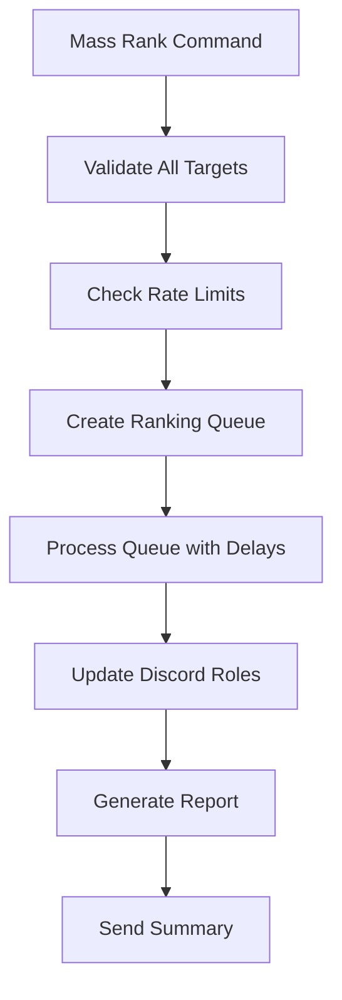

## How Ranking Works

Synera's ranking system is designed to be both powerful and safe, providing fine-grained control over who can rank whom, while preventing accidental demotions or unauthorized promotions.

## Rank Structure

Every Roblox group has a hierarchical rank structure that Synera respects and enhances:

<div className="bg-gradient-to-r from-blue-50 to-purple-50 dark:from-blue-900/20 dark:to-purple-900/20 p-6 rounded-lg my-6">
  <h3 className="text-lg font-semibold mb-4">Example Group Hierarchy</h3>
  <div className="space-y-2">
    <div className="flex items-center justify-between p-2 bg-white dark:bg-gray-800 rounded">
      <span className="font-medium">Owner</span>
      <span className="text-sm text-gray-500">Rank 255</span>
    </div>
    <div className="flex items-center justify-between p-2 bg-white dark:bg-gray-800 rounded">
      <span className="font-medium">Co-Owner</span>
      <span className="text-sm text-gray-500">Rank 200</span>
    </div>
    <div className="flex items-center justify-between p-2 bg-white dark:bg-gray-800 rounded">
      <span className="font-medium">Administrator</span>
      <span className="text-sm text-gray-500">Rank 150</span>
    </div>
    <div className="flex items-center justify-between p-2 bg-white dark:bg-gray-800 rounded">
      <span className="font-medium">Moderator</span>
      <span className="text-sm text-gray-500">Rank 100</span>
    </div>
    <div className="flex items-center justify-between p-2 bg-white dark:bg-gray-800 rounded">
      <span className="font-medium">Member</span>
      <span className="text-sm text-gray-500">Rank 50</span>
    </div>
    <div className="flex items-center justify-between p-2 bg-white dark:bg-gray-800 rounded">
      <span className="font-medium">Guest</span>
      <span className="text-sm text-gray-500">Rank 1</span>
    </div>
  </div>
</div>

## Ranking Commands

Synera provides several commands for managing group ranks:

<Tabs>
  <Tab title="Basic Commands">
    ### `/rank`
    Promote or demote a member to a specific rank.
    
    ```bash
    /rank user:@JohnDoe rank:Moderator reason:"Excellent performance"
    ```
    
    ### `/promote`
    Move a member up one rank level.
    
    ```bash
    /promote user:@JohnDoe reason:"Monthly promotion"
    ```
    
    ### `/demote`
    Move a member down one rank level.
    
    ```bash
    /demote user:@JohnDoe reason:"Violation of rules"
    ```
  </Tab>
  
  <Tab title="Advanced Commands">
    ### `/massrank`
    Rank multiple members at once.
    
    ```bash
    /massrank users:@User1,@User2,@User3 rank:Member
    ```
    
    ### `/ranklock`
    Prevent a member from being ranked by others.
    
    ```bash
    /ranklock user:@JohnDoe lock:true
    ```
    
    ### `/rankhistory`
    View a member's ranking history.
    
    ```bash
    /rankhistory user:@JohnDoe limit:10
    ```
  </Tab>
  
  <Tab title="Utility Commands">
    ### `/groupinfo`
    Display group information and rank structure.
    
    ```bash
    /groupinfo
    ```
    
    ### `/memberinfo`
    Get detailed information about a group member.
    
    ```bash
    /memberinfo user:@JohnDoe
    ```
    
    ### `/ranklist`
    List all members at a specific rank.
    
    ```bash
    /ranklist rank:Moderator
    ```
  </Tab>
</Tabs>

## Permission System

Synera implements a multi-layered permission system to ensure ranking security:

### 1. Discord Role Permissions

Configure which Discord roles can use ranking commands:

<CodeGroup>
```json Basic Setup
{
  "ranking_permissions": {
    "Administrator": ["rank", "promote", "demote", "massrank"],
    "Moderator": ["promote", "demote"],
    "Helper": ["promote"]
  }
}
```

```json Advanced Setup
{
  "ranking_permissions": {
    "Owner": ["*"],
    "Co-Owner": ["rank", "promote", "demote", "massrank", "ranklock"],
    "Administrator": {
      "commands": ["rank", "promote", "demote"],
      "max_rank": "Moderator",
      "restrictions": ["cannot_rank_admins"]
    }
  }
}
```
</CodeGroup>

### 2. Rank-Based Restrictions

Users cannot rank members to positions higher than their own:

<AccordionGroup>
  <Accordion title="Hierarchy Protection" icon="shield">
    - Moderators cannot promote members to Administrator
    - Members cannot demote Administrators
    - Automatic validation prevents hierarchy violations
  </Accordion>
  
  <Accordion title="Self-Ranking Prevention" icon="user-slash">
    - Users cannot rank themselves
    - Prevents accidental self-demotion
    - Maintains accountability in ranking actions
  </Accordion>
  
  <Accordion title="Protected Ranks" icon="lock">
    - Certain ranks can be marked as protected
    - Only specific roles can modify protected ranks
    - Prevents unauthorized access to sensitive positions
  </Accordion>
</AccordionGroup>

### 3. Custom Restrictions

Set up custom rules for your community:

```yaml
restrictions:
  - name: "Trial Period"
    condition: "member_age < 30_days"
    action: "prevent_promotion"
    message: "Members must be in the group for 30 days before promotion"
  
  - name: "Activity Requirement"
    condition: "last_seen > 7_days"
    action: "require_confirmation"
    message: "Member has been inactive for over a week"
  
  - name: "Rank Cooldown"
    condition: "last_ranked < 24_hours"
    action: "prevent_ranking"
    message: "Member was ranked recently, please wait 24 hours"
```

## Ranking Workflows

### Standard Ranking Process

<Steps>
  <Step title="Command Execution">
    User executes a ranking command with target member and desired rank
  </Step>
  <Step title="Permission Validation">
    Synera checks if the user has permission to execute the command
  </Step>
  <Step title="Target Validation">
    Verifies the target member exists and is in the group
  </Step>
  <Step title="Hierarchy Check">
    Ensures the ranking action respects group hierarchy rules
  </Step>
  <Step title="Roblox API Call">
    Executes the ranking change via Roblox's group API
  </Step>
  <Step title="Discord Role Update">
    Updates the member's Discord roles to match their new rank
  </Step>
  <Step title="Audit Logging">
    Records the action in audit logs with timestamp and reason
  </Step>
  <Step title="Confirmation">
    Sends confirmation message with details of the ranking change
  </Step>
</Steps>

### Bulk Ranking Process

For mass ranking operations, Synera uses an optimized workflow:



## Error Handling

Synera gracefully handles various error scenarios:

<CardGroup cols={2}>
  <Card title="API Errors" icon="exclamation-triangle">
    - Roblox API downtime or rate limits
    - Invalid authentication credentials
    - Group permission changes
    - Network connectivity issues
  </Card>
  <Card title="User Errors" icon="user-xmark">
    - Invalid target usernames
    - Insufficient permissions
    - Hierarchy violations
    - Protected rank modifications
  </Card>
  <Card title="System Errors" icon="server">
    - Database connectivity issues
    - Discord API problems
    - Internal processing errors
    - Configuration conflicts
  </Card>
  <Card title="Recovery Actions" icon="arrows-rotate">
    - Automatic retry mechanisms
    - Rollback failed operations
    - Queue failed actions for retry
    - Notify administrators of issues
  </Card>
</CardGroup>

## Audit & Logging

Every ranking action is thoroughly logged:

### Audit Log Format

```json
{
  "timestamp": "2024-01-15T10:30:00Z",
  "action": "rank",
  "executor": {
    "discord_id": "123456789012345678",
    "username": "AdminUser",
    "roblox_id": "987654321"
  },
  "target": {
    "discord_id": "876543210987654321",
    "username": "TargetUser",
    "roblox_id": "123456789"
  },
  "changes": {
    "from_rank": "Member",
    "to_rank": "Moderator",
    "from_rank_id": 50,
    "to_rank_id": 100
  },
  "reason": "Excellent performance and dedication",
  "success": true,
  "group_id": "12345678"
}
```

### Log Retention

- **Standard Logs**: Kept for 90 days
- **Important Actions**: Kept for 1 year
- **Security Events**: Kept for 2 years
- **Export Options**: CSV, JSON, or API access

## Best Practices

<AccordionGroup>
  <Accordion title="Regular Audits" icon="magnifying-glass">
    - Review ranking logs weekly
    - Check for unusual patterns or unauthorized actions
    - Verify Discord-Roblox role synchronization
    - Monitor for permission escalation attempts
  </Accordion>
  
  <Accordion title="Clear Hierarchy" icon="sitemap">
    - Maintain clear rank descriptions and responsibilities
    - Document promotion requirements and criteria
    - Establish consistent naming conventions
    - Regular review of rank structure effectiveness
  </Accordion>
  
  <Accordion title="Training & Documentation" icon="graduation-cap">
    - Train staff on proper ranking procedures
    - Document common scenarios and solutions
    - Create guides for new administrators
    - Regular updates on policy changes
  </Accordion>
  
  <Accordion title="Security Measures" icon="shield-check">
    - Use rank locks for sensitive positions
    - Implement approval workflows for major promotions
    - Regular permission audits and cleanup
    - Monitor for suspicious ranking patterns
  </Accordion>
</AccordionGroup>

---

<Note>
  The ranking system is highly customizable. Contact our support team to discuss advanced configurations 
  specific to your community's needs.
</Note>