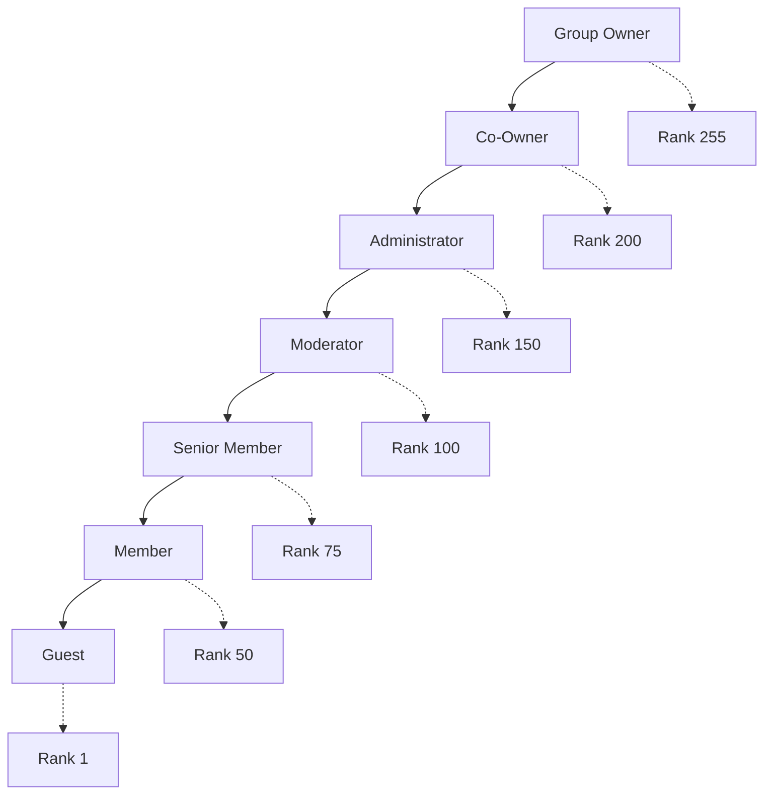

## Roblox API Integration

Synera leverages Roblox's Group API to provide seamless group management capabilities. Our integration is built to be reliable, efficient, and compliant with Roblox's terms of service.

## Group Management

### Supported Group Operations

<CardGroup cols={2}>
  <Card title="Member Ranking" icon="chart-line">
    - Promote/demote members
    - Set specific ranks
    - Bulk ranking operations
    - Rank validation and safety checks
  </Card>
  <Card title="Member Information" icon="user">
    - Retrieve member details
    - Check group membership status
    - View ranking history
    - Monitor member activity
  </Card>
  <Card title="Group Analytics" icon="chart-bar">
    - Member count statistics
    - Rank distribution analysis
    - Activity monitoring
    - Growth tracking
  </Card>
  <Card title="Audit & Compliance" icon="clipboard-check">
    - Complete action logging
    - Permission verification
    - Rate limit compliance
    - Error handling and recovery
  </Card>
</CardGroup>

### Group Structure Analysis

Synera automatically analyzes your group structure to understand the hierarchy and permissions:



## Authentication Methods

### Cookie-Based Authentication (Recommended)

The most reliable method for group management operations:

<Accordion title="How Cookie Authentication Works">
  1. **Secure Storage**: Cookies are encrypted using AES-256 encryption
  2. **Session Management**: Automatic session refresh and validation
  3. **Permission Verification**: Continuous verification of group permissions
  4. **Security Monitoring**: Detection of unauthorized access attempts
</Accordion>

<Warning>
  **Security Notice**: Never share your Roblox cookie with anyone. Synera encrypts and securely stores this information in compliance with UK GDPR regulations.
</Warning>

### API Key Authentication

For users with Roblox Premium and API access:

<Steps>
  <Step title="Generate API Key">
    Create an API key in your Roblox account settings
  </Step>
  <Step title="Configure Permissions">
    Set appropriate permissions for group management
  </Step>
  <Step title="Add to Synera">
    Use the setup command to configure API key authentication
  </Step>
  <Step title="Verify Connection">
    Test the connection and confirm functionality
  </Step>
</Steps>

## Rate Limiting & Optimization

Synera implements sophisticated rate limiting to ensure compliance with Roblox's API limits:

### Rate Limit Management

<Tabs>
  <Tab title="Standard Operations">
    - **Ranking Actions**: 10 requests per minute
    - **Member Queries**: 60 requests per minute  
    - **Group Information**: 100 requests per minute
    - **Bulk Operations**: Automatically spaced with delays
  </Tab>
  
  <Tab title="Optimization Strategies">
    - **Request Batching**: Multiple operations combined when possible
    - **Intelligent Caching**: Frequently accessed data is cached
    - **Queue Management**: Operations queued during high traffic
    - **Priority System**: Critical operations get priority processing
  </Tab>
  
  <Tab title="Error Recovery">
    - **Exponential Backoff**: Automatic retry with increasing delays
    - **Circuit Breaker**: Temporary suspension during API issues
    - **Fallback Mechanisms**: Alternative approaches when primary fails
    - **User Notification**: Clear communication about delays or issues
  </Tab>
</Tabs>

## Data Synchronization

### Real-Time Sync

Synera maintains real-time synchronization between Discord and Roblox:

<div className="bg-gradient-to-r from-green-50 to-blue-50 dark:from-green-900/20 dark:to-blue-900/20 p-6 rounded-lg my-6">
  <h3 className="text-lg font-semibold mb-4">Synchronization Flow</h3>
  <div className="grid grid-cols-1 md:grid-cols-2 gap-4">
    <div className="space-y-3">
      <h4 className="font-medium text-green-700 dark:text-green-300">Discord → Roblox</h4>
      <ul className="space-y-1 text-sm">
        <li>• Role changes trigger rank updates</li>
        <li>• Member joins/leaves sync automatically</li>
        <li>• Permission changes reflected instantly</li>
        <li>• Bulk operations handled efficiently</li>
      </ul>
    </div>
    <div className="space-y-3">
      <h4 className="font-medium text-blue-700 dark:text-blue-300">Roblox → Discord</h4>
      <ul className="space-y-1 text-sm">
        <li>• Rank changes update Discord roles</li>
        <li>• New members get appropriate roles</li>
        <li>• Group changes reflected in Discord</li>
        <li>• Activity status synchronized</li>
      </ul>
    </div>
  </div>
</div>

### Conflict Resolution

When conflicts arise between Discord and Roblox data:

<AccordionGroup>
  <Accordion title="Hierarchy Conflicts" icon="triangle-exclamation">
    **Scenario**: Discord role doesn't match Roblox rank
    
    **Resolution**:
    - Check which change was more recent
    - Apply configurable priority rules
    - Log conflict for administrator review
    - Notify relevant parties of resolution
  </Accordion>
  
  <Accordion title="Permission Mismatches" icon="key">
    **Scenario**: User has Discord permissions but not Roblox rank
    
    **Resolution**:
    - Verify group membership status
    - Check for temporary permission grants
    - Apply least-privilege principle
    - Request administrator intervention if needed
  </Accordion>
  
  <Accordion title="Data Inconsistencies" icon="database">
    **Scenario**: Cached data doesn't match live data
    
    **Resolution**:
    - Force refresh from authoritative source
    - Update cache with correct information
    - Validate related data for consistency
    - Implement additional validation checks
  </Accordion>
</AccordionGroup>

## Multi-Group Support

Synera can manage multiple Roblox groups from a single Discord server:

### Configuration Example

```json
{
  "groups": {
    "primary": {
      "id": "12345678",
      "name": "Main Group",
      "role_prefix": "MG",
      "sync_enabled": true,
      "permissions": {
        "ranking": ["Admin", "Moderator"],
        "viewing": ["Member"]
      }
    },
    "secondary": {
      "id": "87654321", 
      "name": "Allied Group",
      "role_prefix": "AG",
      "sync_enabled": false,
      "permissions": {
        "ranking": ["Owner"],
        "viewing": ["Admin"]
      }
    }
  }
}
```

### Cross-Group Operations

- **Unified Commands**: Single commands can affect multiple groups
- **Synchronized Roles**: Maintain consistency across groups
- **Centralized Logging**: All group activities logged together
- **Permission Inheritance**: Share permissions across related groups

## Security & Compliance

### Data Protection

<CardGroup cols={2}>
  <Card title="Encryption" icon="lock">
    - All authentication data encrypted at rest
    - TLS encryption for all API communications
    - Regular security audits and updates
    - Compliance with UK GDPR requirements
  </Card>
  <Card title="Access Control" icon="shield-check">
    - Role-based access to group functions
    - Audit trails for all administrative actions
    - IP whitelisting for sensitive operations
    - Multi-factor authentication support
  </Card>
</CardGroup>

### Compliance Features

- **GDPR Compliance**: Full data protection compliance
- **Audit Logging**: Complete action history
- **Data Retention**: Configurable retention policies
- **Right to Erasure**: User data deletion capabilities

## Error Handling

### Common Scenarios

<Tabs>
  <Tab title="Authentication Errors">
    **Invalid Cookie/API Key**
    - Automatic detection of expired credentials
    - Secure notification to administrators
    - Graceful degradation of functionality
    - Clear instructions for credential renewal
    
    **Insufficient Permissions**
    - Real-time permission validation
    - Detailed error messages with solutions
    - Automatic permission requirement checks
    - Escalation to group owners when needed
  </Tab>
  
  <Tab title="API Errors">
    **Rate Limit Exceeded**
    - Automatic queue management
    - User notification of delays
    - Priority handling for critical operations
    - Intelligent retry scheduling
    
    **Service Unavailable**
    - Circuit breaker pattern implementation
    - Fallback to cached data when appropriate
    - User notification of service issues
    - Automatic recovery when service resumes
  </Tab>
  
  <Tab title="Data Errors">
    **Member Not Found**
    - Verification of username/ID accuracy
    - Suggestions for similar usernames
    - Group membership verification
    - Clear error messages with next steps
    
    **Invalid Rank**
    - Validation against current group structure
    - Suggestions for valid ranks
    - Permission level verification
    - Automatic rank structure updates
  </Tab>
</Tabs>

## Performance Monitoring

### Key Metrics

- **API Response Time**: Average time for Roblox API calls
- **Success Rate**: Percentage of successful operations
- **Sync Accuracy**: Accuracy of Discord-Roblox synchronization
- **Error Frequency**: Rate and types of errors encountered

### Optimization Techniques

<AccordionGroup>
  <Accordion title="Caching Strategy" icon="database">
    - **Member Data**: 5-minute cache for frequently accessed members
    - **Group Structure**: 1-hour cache for rank hierarchy
    - **Permissions**: 15-minute cache for permission matrices
    - **Statistics**: 30-minute cache for group analytics
  </Accordion>
  
  <Accordion title="Request Optimization" icon="zap">
    - **Batch Processing**: Combine multiple operations
    - **Parallel Requests**: Execute independent operations simultaneously
    - **Smart Queuing**: Prioritize based on operation importance
    - **Connection Pooling**: Reuse connections for efficiency
  </Accordion>
  
  <Accordion title="Load Balancing" icon="scale-balanced">
    - **Geographic Distribution**: Servers closer to Roblox infrastructure
    - **Request Distribution**: Spread load across multiple endpoints
    - **Failover Systems**: Automatic switching during outages
    - **Capacity Scaling**: Dynamic scaling based on demand
  </Accordion>
</AccordionGroup>

---

<Note>
  Roblox integration is continuously updated to leverage new API features and improvements. 
  Our team monitors Roblox's developer updates to ensure compatibility and optimal performance.
</Note>